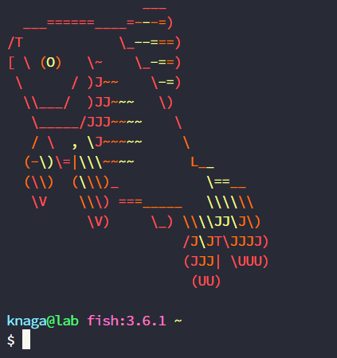

# Fish を使う

- 作成日: 2023/4/22
- 環境: WSL2: Ubuntu

## インストール

この `README.md` が置いてあるディレクトリ（`00_FISH/`）に移動し，`install_fish.sh` ファイルを実行すると fish がインストールされる．途中，`sudo` コマンドを使うために Ubuntu のパスワードが要求される．

```sh
$ cd 00_Fish/
$ bash install_fish.sh
```

インストール完了後，`fish` と打つとお魚のアスキーアートの表示とともに fish が起動する．

```sh
$ fish
```

初期画面の例

<center></center>

fish から bash に戻りたいときは `bash` と打てばよい．

```sh
$ bash
```

Bash に慣れている人向けの補足
- `~/.bashrc` に対応する設定ファイルは `~/.config/fish/config.fish`
- 環境変数の定義やfor文など bash/zsh といくつか記法が異なるが，普段使いには困らないはず
- alias に加えて **abbr** (=abbreviation) という機能が導入されている．使い方は alias と同じだが，abbr はスペースを打つと自動で展開される．例えば
	```sh
	# ~/.config/fish/config.fish
	abbr -a g g++ -std=c++17
	```
  という abbr を設定すると，`g` と打ってスペースを押せば
	```sh
	$ g++ -std=c++17
	```
  のようにコマンドを置き換えてくれる．もちろん編集可能．コマンドの可読性が上がるので alias の代わりに abbr の使用をオススメする．


## デフォルト shell を変える

Ubuntu の起動時にはデフォルトの shell が呼び出される．`echo $SHELL` を実行すると現在の設定が確認できる．Ubuntu では通常 `bash` が指定されているはず．

```sh
$ echo $SHELL
/usr/bin/bash
```

デフォルトの shell を変えるには，`chsh` コマンドに変えたい shell のパスを渡せば良い．なお，fish や bash shell のパスは `which` コマンドで調べられる．

- bash -> fish

	```sh
	$ which fish
	/usr/bin/fish

	$ chsh -s /usr/bin/fish
	```

- fish -> bash

	```sh
	$ which bash
	/usr/bin/bash

	$ chsh -s /usr/bin/bash
	```


## Fish のテーマを変える

`~/.config/fish/themes/` に Dracula theme を追加してある．これを有効にするには fish の設定ファイル `~/.config/fish/config.fish` にテーマを読み込ませるための記述を加える必要がある．既にコメントアウトして書いてあるので，`#` を外すだけでよい．

- 前

	```sh
	# fish_config theme choose "Dracula Official"
	```
- 後
	```sh
	fish_config theme choose "Dracula Official"
	```

`~/.config/fish/config.fish` などの設定ファイルの編集は vim や emacs 等のターミナル上で開けるエディタを使うと楽だが，初学者には難しい．そこで，設定ファイル等をテキストエディタアプリで開く方法をいくつか書いておく．

1. File Explorer から探して開く（面倒）
2. 1 を Ubuntu から実行する
	```sh
	$ explorer.exe ~/.config/fish/config.fish
	```
3. Ubuntu から vscode を立ち上げて開く
	```sh
	$ code ~/.config/fish/config.fish
	```

## VSCodeのデフォルトシェルをfishに変える

コマンドパレットを開き (ctrl+shift+P)，
```
> Terminal: Select Default Profile
```
と入力して選ぶと，シェルが選択できるようになる．ここでfishを選択する．

## MacOSへのインストール

Apt コマンドがあるなら上と同じ方法でインストールできる．

しかし，M1チップで apt コマンドが使えない現象が発生する．
> https://discussions.apple.com/thread/253451403

Homebrewから入れる
> https://zenn.dev/meihei/articles/390d6dbbb4c936

Homebrew の入れ方

- Command Line Tools (CLT) for Xcode を入れる

	```sh
	$ xcode-select --install
	```

- brew のインストール

	```sh
	$ /bin/bash -c "$(curl -fsSL https://raw.githubusercontent.com/Homebrew/install/HEAD/install.sh)"
	```

	コマンドを実行すると，最後の方に以下のようなコマンドを実行するように言われる．表示されたコマンドをコピーして実行する．

	```sh
	$ echo 'eval "$(/opt/homebrew/bin/brew shellenv)"' >> /Users/[your-user-name]/.zprofile
	$ eval "$(/opt/homebrew/bin/brew shellenv)"
	```

	brew が入っていることを確認

	```sh
	$ brew --version
	```

- fish のインストール

	```sh
	$ brew install fish
	```

	コマンドを実行すると，最後の方に以下のようなコマンドを実行するように言われる．表示されたコマンドをコピーして実行する．インストールされた fish コマンドのパスを確認しよう．

	```sh
	$ which fish
	```

	- `/opt/homebrew/bin/fish` と出た場合
		
		fish のパスを追加

		```sh
		$ fish_add_path /opt/homebrew/bin
		```

		fish シェルを標準シェルに追加

		```sh
		$ echo /opt/homebrew/bin/fish | sudo tee -a /etc/shells
		```

		デフォルトシェルを fish に変更
		
		```sh
		$ chsh -s /opt/homebrew/bin/fish
		```

	- `/usr/local/bin/fish` と出た場合

		fish のパスを追加

		```sh
		$ fish_add_path /usr/local/bin/
		```

		fish シェルを標準シェルに追加

		```sh
		$ echo /usr/local/bin/fish | sudo tee -a /etc/shells
		```

		デフォルトシェルを fish に変更
		
		```sh
		$ chsh -s /usr/local/bin/fish
		```

