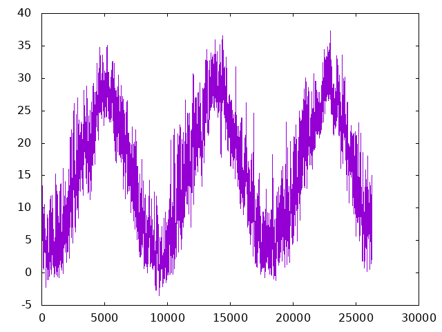
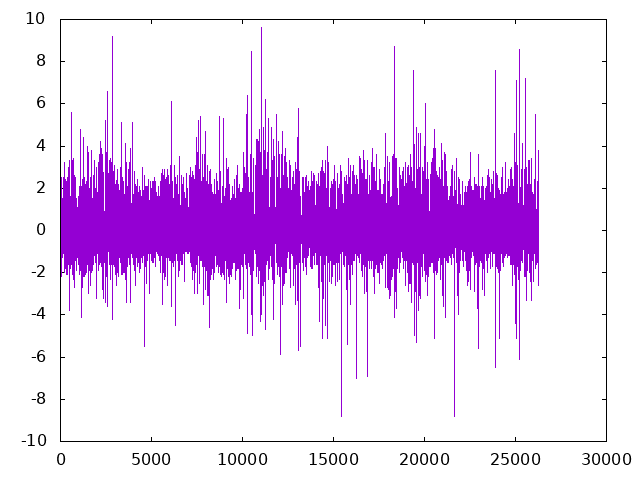

# PRG SEMINAR 01: UNIX

<center></center>

data/以下のファイル一覧
```txt
- raw
	- kanazawa2017-2019_raw.csv （ガチ生データ　　　，配らない）
	- kanazawa2017-2019_utf8.csv（文字コード変換済み，配らない）
	- kanazawa2017-2019.csv     （時刻0:00を前日24:00に変換済み，配布用）
- 2017
	- kanazawa2017.csv    （2017年のレコードを抽出）
	- kanazawa2017_min.csv（年月日時・気温を抽出，年月日と時刻を分離，欠損値除去）
- 2018
	- kanazawa2018.csv
	- kanazawa2018_min.csv
- 2019
	- kanazawa2019.csv
	- kanazawa2019_min.csv
- 2017_2019
	- kanazawa2017_2019_min.csv     （各年のminファイルをマージ）
	- kanazawa2017_2019_min_diff.csv（差分時系列）
```

## 準備：最初に渡す生データの加工

- nkfコマンドで文字コード変換（Shift-JIS -> UTF-8）
- 時刻0:00を前日の24:00に変換する（気象庁は日平均気温を1時から24時の24回の観測値から計算する）
- `data/raw/kanazawa2017-2019.csv`を配布

```sh
# 文字化けしていることを確認
$ head -n5 data/raw/kanazawa2017-2019_raw.csv
�N������,�C��(��),�~����(mm),����(m/s),����(m/s),�ϐ�(cm),�~��(cm),���n�C��(hPa)
2017/1/1 1:00,7.5,0.5,5.9,��쐼,0,0,1020.4
2017/1/1 2:00,7.4,0,5.6,��쐼,0,0,1020.6
2017/1/1 3:00,6.8,0.5,4.4,��쐼,0,0,1020.8
2017/1/1 4:00,6.3,2.5,0.9,��쐼,0,0,1020.7

# 文字コードを確認
$ nkf -g data/raw/kanazawa2017-2019_raw.csv 
Shift_JIS

# 文字コードの変換
$ nkf -Lu data/raw/kanazawa2017-2019_raw.csv > data/raw/kanazawa2017-2019_utf8.csv 

# 文字化けしてないことを確認
$ head -n5 data/raw/kanazawa2017-2019_utf8.csv
年月日時,気温(℃),降水量(mm),風速(m/s),風速(m/s),積雪(cm),降雪(cm),現地気圧(hPa)
2017/1/1 1:00,7.5,0.5,5.9,南南西,0,0,1020.4
2017/1/1 2:00,7.4,0,5.6,南南西,0,0,1020.6
2017/1/1 3:00,6.8,0.5,4.4,南南西,0,0,1020.8
2017/1/1 4:00,6.3,2.5,0.9,南南西,0,0,1020.7

# 文字コードを確認
$ nkf -g data/raw/kanazawa2017-2019_utf8.csv
UTF-8

# 時刻0:00を前日24:00に変換（日付と時刻の間のspaceを活用）
#（正直，エディタで編集するのが一番早い...）
$ cat data/raw/kanazawa2017-2019_utf8.csv | sed 's/ 0:00/ 24:00/g' | awk '{if(substr($2,1,2)!=24){date=$1; print $1,$2}else{print date,$2}}' > data/raw/kanazawa2017-2019.csv 

$ cat data/raw/kanazawa2017-2019.csv | tail -n5
2019/12/31 20:00,3.4,0,3.2,北,0,0,1022.4
2019/12/31 21:00,2.8,0.5,3.4,西北西,0,0,1022.4
2019/12/31 22:00,2.4,0,2,西,0,0,1022.7
2019/12/31 23:00,2.5,0,3,南東,0,0,1022.4
2019/12/31 24:00,2,0,3,東,0,0,1022.3
```

## 0. 生データをざっくり確認
- head, tail
- 年ごと，月ごとのデータ数
- 時系列のプロット

```sh
$ head -n5 data/raw/kanazawa2017-2019.csv
年月日時,気温(℃),降水量(mm),風速(m/s),風速(m/s),積雪(cm),降雪(cm),現地気圧(hPa)
2017/1/1 1:00,7.5,0.5,5.9,南南西,0,0,1020.4
2017/1/1 2:00,7.4,0,5.6,南南西,0,0,1020.6
2017/1/1 3:00,6.8,0.5,4.4,南南西,0,0,1020.8
2017/1/1 4:00,6.3,2.5,0.9,南南西,0,0,1020.7

# 年ごとのデータ数を確認
$ cat data/raw/kanazawa2017-2019.csv | awk -F"/" '{a[$1]++}END{for(i in a)print i,a[i]}' | sort -k1,1g
年月日時,気温(℃),降水量(mm),風速(m 1
2017 8760
2018 8760
2019 8760

# 月ごとのデータ数を確認（ソートするために年月をintに変換）
$ cat data/raw/kanazawa2017-2019.csv | awk -F"/" '{a[$1*100+$2]++}END{for(i in a)print i,a[i]}' | sort -k1,1g | head -n5
0 1
201701 743
201702 672
201703 744
201704 720

# 温度の時系列を描いてみる
$ cat data/raw/kanazawa2017-2019.csv | awk -F, '{if(NR>1 && $2!="")print $2}' | gnuplot -p -e "set terminal png; set output 'figure/temperature.png'; p '<cat' w l t''"
```

<center></center>


## 1. 年ごとにデータを分ける

やること
- 年ごとのディレクトリを作る
- 年ごとにファイルを分ける
- 年ごとに必要な部分を取り出す（年月日時，気温）
- 年月日と時刻は分離する
- 欠損値があったら行ごと除去する

```sh
# 年ごとのディレクトリを作る
$ mkdir data/2017 data/2018 data/2019

# 年ごとにファイルを分ける
$ cat data/raw/kanazawa2017-2019.csv | grep 2017 > data/2017/kanazawa2017.csv
$ cat data/raw/kanazawa2017-2019.csv | grep 2018 > data/2018/kanazawa2018.csv
$ cat data/raw/kanazawa2017-2019.csv | grep 2019 > data/2019/kanazawa2019.csv

# （一括でやる方法）
$ for year in {2017..2019}; do cat data/raw/kanazawa2017-2019.csv | grep $year > data/"$year"/kanazawa"$year".csv; done

# 年ごとに必要な部分を取り出す（年月日時，気温）
$ cat data/2017/kanazawa2017.csv | awk -F, -v OFS="," '{print $1,$2}' | head -n5
2017/1/1 1:00,7.5
2017/1/1 2:00,7.4
2017/1/1 3:00,6.8
2017/1/1 4:00,6.3
2017/1/1 5:00,5.9

# さらに，年月日と時刻は分離する（" "を","で置換）
$ cat data/2017/kanazawa2017.csv | awk -F, -v OFS="," '{print $1,$2}' | sed 's/ /,/g' | head -n5
2017/1/1,1:00,7.5
2017/1/1,2:00,7.4
2017/1/1,3:00,6.8
2017/1/1,4:00,6.3
2017/1/1,5:00,5.9

# 欠損値が1つ入っている
$ cat data/2019/kanazawa2019.csv | awk -F, -v OFS="," '{if($2=="")print $1,$2}'
2019/12/25,10:00,

# 欠損値があったら行ごと除去する（grep）
$ cat data/2019/kanazawa2019.csv | awk -F, -v OFS="," '{if($2!="")print $1,$2}' | sed 's/ /,/g' | awk -F, '{if($3!="")print $0}' | grep 2019/12/25 | head -n10 | tail -n2
2019/12/25,9:00,5.1
2019/12/25,11:00,10.6

# ファイル出力（各年，2018と2019は省略）
$ cat data/2019/kanazawa2017.csv | awk -F, -v OFS="," '{print $1,$2}' | sed 's/ /,/g' | awk -F, '{if($3!="")print $0}' > data/2017/kanazawa2017_min.csv

# ファイル出力（一括）
$ for year in {2017..2019}; do cat data/"$year"/kanazawa"$year".csv | awk -F, -v OFS="," '{if($2!="")print $1,$2}' | sed 's/ /,/g' > data/"$year"/kanazawa"$year"_min.csv; done
```


## 2. 年ごとの，気温が20度を超えた時刻の割合

結果
- 2017: 0.330479
- 2018: 0.353995
- 2019: 0.371161

```sh
$ cat data/2017/kanazawa2017_min.csv | awk -F, -v OFS="," '{if($3>20)cnt++}END{print cnt/NR}'
0.330479

$ for year in 2017 2018 2019; do cat data/"$year"/kanazawa"$year"_min.csv | awk -F, -v OFS="," -v year=$year '{if($3>20)n++}END{print year": "n/NR}'; done
2017: 0.330479
2018: 0.353995
2019: 0.371161
```

## 3. 年ごとの，平均気温のmin/max/mean/std

結果
```txt
=== 2017 ===
min: -2.2
max: 35.1
mean: 15.0161
std: 8.82435

=== 2018 ===
min: -3.5
max: 36.6
mean: 15.6038
std: 9.35428

=== 2019 ===
min: -1.2
max: 37.3
mean: 15.8083
std: 8.7559
```

```sh
# 2017年の気温のmin/maxを計算
$ cat data/2017/kanazawa2017_min.csv | awk -F, '{print $3}' | awk 'BEGIN{min=100;max=-100}{if($1<min) min=$1; if($1>max) max=$1}END{print "min: "min; print "max: "max}'
min: -2.2
max: 35.1

# 2017年の気温のmean/stdを計算
$ cat data/2017/kanazawa2017_min.csv | awk -F, '{print $3}' | awk '{sum+=$1; sumsq+=$1*$1}END{mean=sum/NR; std=sqrt(sumsq/NR-mean*mean); print "mean: "mean; print "std: "std}'
mean: 15.0161
std: 8.82435

# 2017年の気温のmin/max/mean/stdを計算（上2つをまとめる）
$ cat data/2017/kanazawa2017_min.csv | awk -F, '{print $3}' | awk 'BEGIN{min=100;max=-100}{if($1<min) min=$1; if($1>max) max=$1; sum+=$1; sumsq+=$1*$1}END{print "min: "min; print "max: "max; mean=sum/NR; std=sqrt(sumsq/NR-mean*mean); print "mean: "mean; print "std: "std}'
min: -2.2
max: 35.1
mean: 15.0161
std: 8.82435

# 3年分をまとめて計算
$ for year in 2017 2018 2019; do echo; echo === $year ===; cat data/$year/kanazawa"$year"_min.csv | awk -F, '{print $3}' | awk 'BEGIN{min=100;max=-100}{if($1<min) min=$1; if($1>max) max=$1; sum+=$1; sumsq+=$1*$1}END{print "min: "min; print "max: "max; mean=sum/NR; std=sqrt(sumsq/NR-mean*mean); print "mean: "mean; print "std: "std}'; done

=== 2017 ===
min: -2.2
max: 35.1
mean: 15.0161
std: 8.82435

=== 2018 ===
min: -3.5
max: 36.6
mean: 15.6038
std: 9.35428

=== 2019 ===
min: -1.2
max: 37.3
mean: 15.8083
std: 8.7559
```


## 4. 全期間を対象に，気温の前時刻差分時系列を計算

やること
- 3年分の気温のファイルを1つにまとめる
- 日時でソート（不要）
- 差分時系列を計算

```sh
# 3年分の気温のファイルを1つにまとめる
$ mkdir data/2017_2019
$ cat data/2017/kanazawa2017_min.csv data/2018/kanazawa2018_min.csv data/2019/kanazawa2019_min.csv > data/2017_2019/kanazawa2017-2019_min.csv

# 差分時系列を計算
$ cat data/2017_2019/kanazawa2017-2019_min.csv | awk -F, '{if(NR==1){prev=$3}else{print $3-prev; prev=$3}}' | head -n5
-0.1
-0.6
-0.5
-0.4
0.2

# ファイル出力
$ cat data/2017_2019/kanazawa2017-2019_min.csv | awk -F, '{if(NR==1){prev=$3}else{print $3-prev; prev=$3}}' > data/2017_2019/kanazawa2017-2019_min_diff.csv

# 前時刻との差分時系列を描いてみる
$ cat data/2017_2019/kanazawa2017-2019_min_diff.csv | gnuplot -p -e "set terminal png; set output 'figure/temperature_diff.png'; p '<cat' w l t''"
```

<center></center>


## 5. 月平均気温を求める

```sh
$ cat data/2017_2019/kanazawa2017-2019_min.csv | sed 's|/|,|g' | awk -F, -v OFS="," '{month=$1*100+$2; sum[month]+=$5; cnt[month]++}END{for(month in sum)print month,sum[month]/cnt[month]}' > result/monthly_average.csv

$ head -n5 result/monthly_average.csv
201701,4.48293
201702,4.42158
201703,7.15336
201704,13.5953
201705,18.92
```

## 6. 日ごとの統計量を求める

```sh
$ cat data/2017_2019/kanazawa2017-2019_min.csv | sed 's|/|,|g' | awk -F, -v OFS="," '{date=10000*$1+100*$2+$3; if(min[date]==""){min[date]=$5}; if(max[date]==""){max[date]=$5}; if($5<min[date]){min[date]=$5}; if($5 > max[date]){max[date]=$5}; sum[date]+=$5; sumsq[date]+=$5*$5; cnt[date]++}END{print "date,min,max,mu,std"; for(date in sum){mean=sum[date]/cnt[date]; std=sqrt(sumsq[date]/cnt[date] - mean*mean); print date,min[date],max[date],mean,std}}' | sort -k1,1g > result/daily_stats.csv

$ head -n5 result/daily_stats.csv
date,min,max,mu,std
20170101,5.9,11,8.325,1.57222
20170102,5.1,13.4,9.15833,2.76419
20170103,5.8,9.8,7.27917,1.14236
20170104,6.2,11,8.04583,1.43555
```


## 補足

nkfコマンドを入れる

```sh
# ubuntu（update/upgradeはやらなくても良い）
$ sudo apt update
$ sudo apt upgrade
$ sudo apt install nkf

# mac（brewが入っていれば1つ目は飛ばす）
$ /bin/bash -c "$(curl -fsSL https://raw.githubusercontent.com/Homebrew/install/HEAD/install.sh)"
$ brew install nkf
```

Bashのfor文

```sh
# 書き方
$ for <element> in <array>; do <something>; done

# 例
$ for i in 1 2 3; do echo $s; done

# 連番のリストはブレースで書ける
$ for i in {1..3}; do echo $i; done
```

Awk
- 部分文字列を抽出: `substr(str,startIndex,length)`
- 外から変数を渡す: `-v varName1="var1" -v varName2="var2"`
