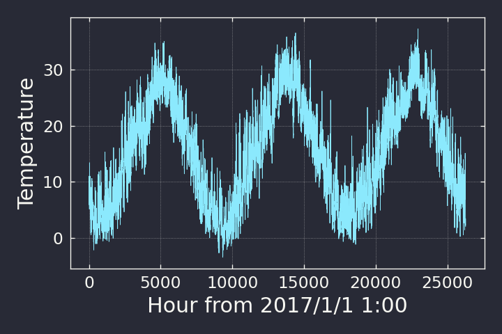
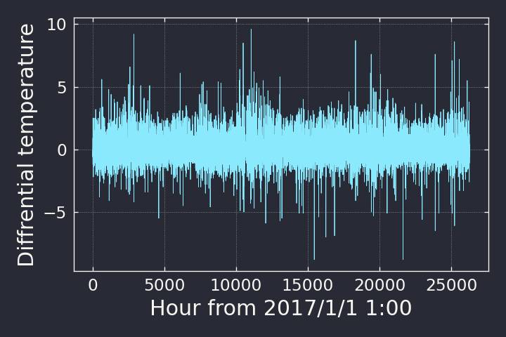
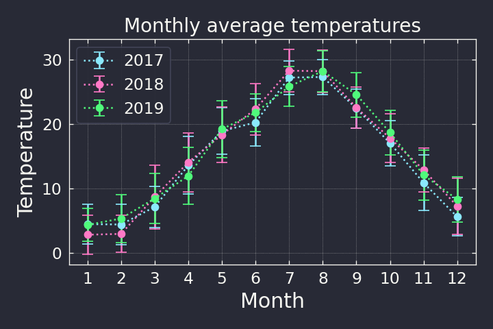
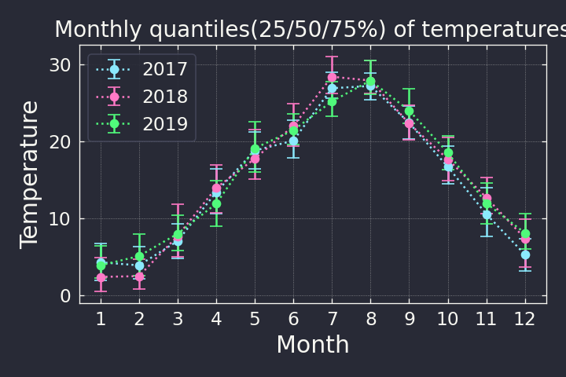

# PRG SEMINAR 02: C++

data以下のファイル一覧
```txt
- kanazawa2017_min.csv（年月日，時刻，気温；欠損値除去済）
- kanazawa2018_min.csv
- kanazawa2019_min.csv
- kanazawa2017-2019_min.csv 各年のminファイルをマージ）
```

result以下のファイル一覧
```txt
- kanazawa2017-2019_diff.csv（minファイルの前時刻差分時系列）
- monthly_average.csv（月平均気温）
- daily_stats.csv（日ごとの統計量）
```

## 2. 年ごとの，気温が20度を超えた時間の割合
## 3. 年ごとの，気温のmin/max/mean/std

```sh
# コンパイル
$ g++ -std=c++17 src/calc_yearly.cpp -o bin/calc_yearly

$ bin/calc_yearly data/kanazawa2017_min.csv 
%(T>20): 0.330479
min: -2.2
max: 35.1
mu : 15.0161
std: 8.82435

$ bin/calc_yearly data/kanazawa2018_min.csv
%(T>20): 0.353995
min: -3.5
max: 36.6
mu : 15.6038
std: 9.35428

$ bin/calc_yearly data/kanazawa2019_min.csv
%(T>20): 0.371161
min: -1.2
max: 37.3
mu : 15.8083
std: 8.7559
```

## 4. 全期間を対象に，気温の前時刻差分時系列を計算

プロット


<!-- ```sh
$ awk -F, '{print $3}' data/kanazawa2017-2019_min.csv | gnuplot -p -e "set xlabel 'Hour from 2017/1/1 1:00'; set ylabel 'Temperature'; set terminal png; set output 'figure/temperature.png'; p '<cat' w l t''"
``` -->

<center></center>


前時刻との差分時系列を計算

```sh
$ g++ -std=c++17 src/calc_diff.cpp -o bin/calc_diff

$ bin/calc_diff data/kanazawa2017-2019_min.csv result/kanazawa2017-2019_diff.csv

$ head -n5 result/kanazawa2017-2019_diff.csv
-0.1
-0.6
-0.5
-0.4
0.2
```

プロット

<!-- ```sh
$ cat data/kanazawa2017-2019_diff.csv | gnuplot -p -e "set xlabel 'Hour from 2017/1/1 1:00'; set ylabel 'Diff of temperature'; set terminal png; set output 'figure/temperature_diff.png'; p '<cat' w l t''"
``` -->

<center></center>


## 5. 月ごとの集計

月平均気温を計算してみる．

```sh
$ g++ -std=c++17 src/calc_monthly.cpp -o bin/calc_monthly

$ bin/calc_monthly data/kanazawa2017-2019_min.csv result/monthly_average.csv

$ head -n5 result/monthly_average.csv
201701,4.48293
201702,4.42158
201703,7.15336
201704,13.5953
201705,18.92
```

今後，2種類のエラーバーを描けるようになる必要があります

- 平均±標準偏差
- 分位数（25%,50%,75% or 5%,50%,95%）

### 例1: 平均気温をプロット
<center></center>

### 例2: 四分位数をプロット
<center></center>


## 6. 日ごとの集計

日ごとに最小値・最大値・平均・標準偏差のひと塊を計算してvectorに格納したいなら，クラスや構造体を使ってみてもよい．

```sh
$ g++ -std=c++17 src/calc_daily.cpp -o bin/calc_daily

$ bin/calc_daily data/kanazawa2017-2019_min.csv result/daily_stats.csv

$ head -n5 result/daily_stats.csv
date,min,max,mu,std
20170101,5.9,11,8.325,1.57222
20170102,5.1,13.4,9.15833,2.76419
20170103,5.8,9.8,7.27917,1.14236
20170104,6.2,11,8.04583,1.43555
```


## 補足

- c++17 が必要なのは map の範囲 for 文
- auto や vector の範囲 for 文は c++11 から搭載されている