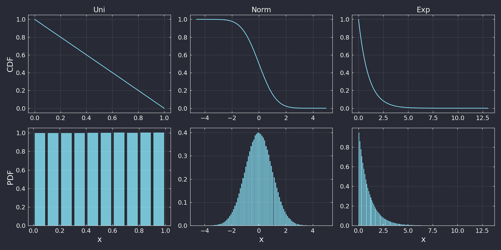

# PRG SEMINAR 05: RANDOM

- Date: 2023/05/24
- Goal: 様々な確率分布に従う乱数を生成できるようになる
- Note: 擬似乱数生成器はメルセンヌ・ツイスタを用いる

## 課題（一部のみ）

1. 一様乱数 U(0,1) を生成してCDF・PDFを確認
2. 正規乱数 N(0,1) を生成してCDF・PDFを確認：Box-muller法を使用
3. 指数乱数 Exp(1) を生成してCDF・PDFを確認：逆関数法を使用

## 結果

